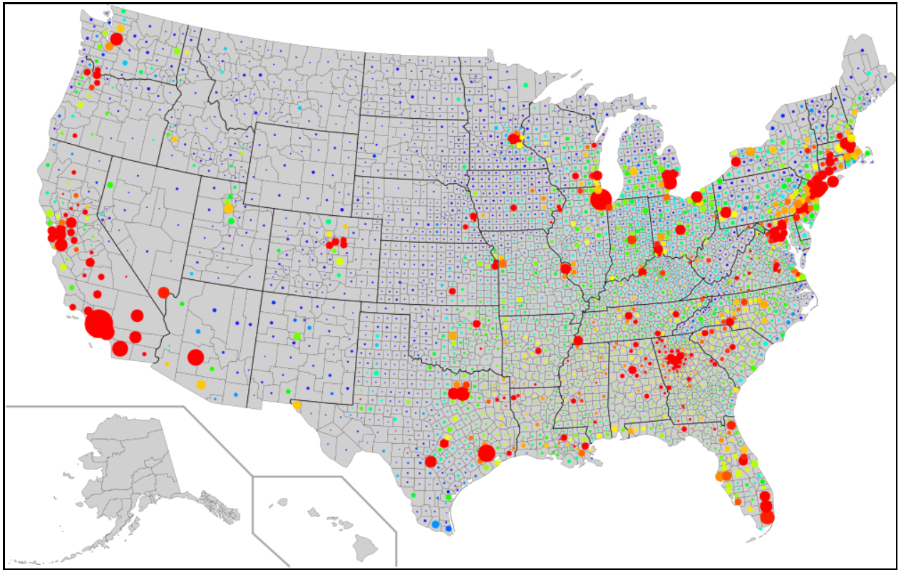
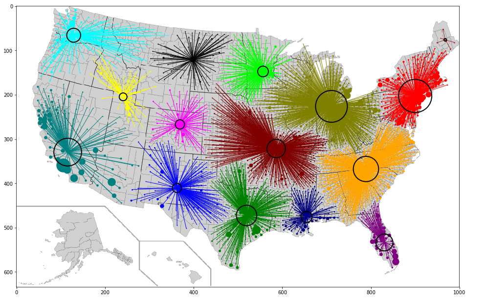
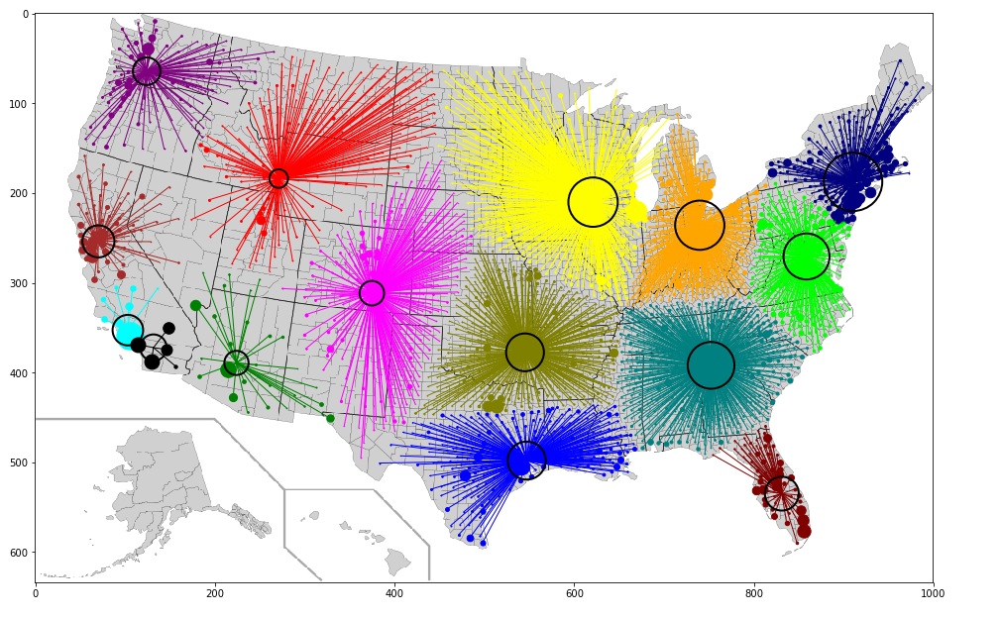
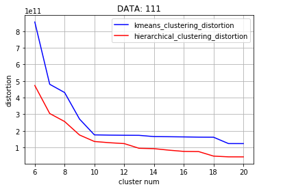
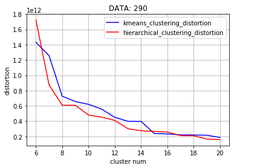
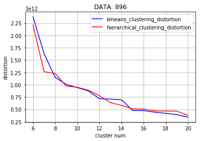

# Closest-Pairs-And-Clustering
使用两种聚类算法来分析城市的患癌情况，并比较两种聚类算法的效率与质量

数据获取：https://www.epa.gov/national-air-toxics-assessment/2005-national-air-toxics-assessment

### 全国的城市患癌风险总览
半径大小代表人口多少，颜色代表患癌的风险

### hierarchical clustering 和 k-means clustering
hierarchical clustering

k-means clustering

### 两种聚类算法失真率比较

 :sparkles:
